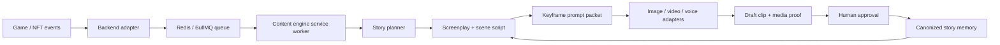

# MineBTC AI Content Engine

Open-source AI showrunner infrastructure for game-native characters, story memory, prompt grammar, and video generation.

[](https://github.com/LifeOrDream/minebtc-ai-content-engine/actions/workflows/ci.yml)
[](LICENSE)
[](package.json)

MineBTC is the first reference world: a country-vs-country degenBTC mining game where HashBeast characters evolve through gameplay and become the cast of an ongoing AI-generated show. The engine is meant to be reusable by other games, NFT worlds, creator communities, and agentic media teams that want structured story continuity instead of one-off AI clips.

## Why This Exists

Most AI video pipelines are prompt piles. They do not remember characters, they do not track story arcs, and they do not have a clean way to evaluate whether a generated clip stayed on-brand.

This repo is our attempt to make the pipeline inspectable and improvable:

- Event-driven story planning from game/NFT state.
- Character canon blocks that preserve breed, role, personality, gear, voice, and recent story.
- Director grammar for consistent visual style across image and video models.
- Multi-pass trailer scripting with engagement, dialogue, polish, direction, compile, and frame passes.
- Redis/BullMQ service mode so a production backend can call the engine without importing it as local code.
- Media proof and quality scorecards so contributors can improve outputs with evidence.

## Current Status

This is early, real code extracted from the MineBTC production/backend pipeline. The public API and folder layout may change while we make it contributor-friendly.

Useful contribution areas today:

- Better scene/dialogue prompts.
- Better Seedance / image-to-video motion prompts.
- Better keyframe prompt structure for Nano Banana / image models.
- Country/world-pack character and environment definitions.
- Quality evaluation, media proof tooling, and benchmark fixtures.
- Provider adapters for image, video, speech, music, and lip-sync models.

## Quick Start

Runtime: Node 22+ recommended.

```bash
npm install
npm run typecheck
npm run demo:fixture
```

`npm run demo:fixture` uses local fake MineBTC state only. It does not call FAL, Gemini, AWS, Telegram, Redis, or the MineBTC backend.

## Common Commands

```bash
# Verify TypeScript
npm run typecheck

# Run a no-key contributor demo
npm run demo:fixture

# Run the Redis/BullMQ worker used by MineBtcBackend
npm run service:worker

# Generate / iterate script passes for trailer 01
npm run trailer:script -- 01

# Render the final trailer from trailer/out/<id>/scenes.json
npm run trailer:generate -- 01

# Canonize a posted video into story memory
npm run trailer:canonize -- 01 --platform x --url https://x.com/... --video-no 1
```

## Architecture



MineBTC production runs this as a service boundary:

- Backend owns game state, DB reads/writes, budget gates, persistence, and posting.
- Content engine owns creative planning, director grammar, screenplay/script generation, keyframe prompt generation, trailer pipeline, and media-generation helpers.
- Queue name defaults to `minebtc-content-engine`; set `CONTENT_ENGINE_QUEUE` in both repos if it changes.

Local service mode needs Redis or Valkey:

```bash
docker run -d -p 6379:6379 --name valkey valkey/valkey:alpine
npm run service:worker
```

## Folder Map

```text
src/content-engine/       Pure creative primitives: prompt grammar, fixtures, screenplay normalization.
src/service/              Redis/BullMQ worker contracts and job processor.
src/utils/                Media/provider helpers used by local trailer generation.
trailer/blueprints/       Launch trailer rough story clay and series bible.
trailer/pipeline/         Multi-pass screenplay/script compiler.
trailer/generate/         Frame, video, audio, lip-sync, and assembly pipeline.
trailer/world/            Country cast, location registry, and canon story memory.
docs/                     Contributor docs, architecture, proof, world packs, adapters.
.github/                  Issue templates, PR template, labels, CI, and ownership.
```

## Documentation

- [Architecture](docs/architecture.md)
- [Contributor Playbook](CONTRIBUTING.md)
- [Media Proof and Evals](docs/evals-and-media-proof.md)
- [Provider Adapters](docs/provider-adapters.md)
- [World Packs](docs/world-packs.md)
- [Trailer Pipeline](trailer/README.md)
- [Labels](docs/labels.md)
- [Security](SECURITY.md)

## How To Contribute

Start with issues labeled `good first issue`, `area: prompts`, `area: evals`, `area: world-pack`, or `proof: needed`.

For prompt/video changes, PRs should include media proof:

- What behavior you improved.
- Exact command or generation path.
- Prompt packet or changed fixture.
- Before/after frame or clip if available.
- Quality scorecard: character consistency, brand fit, dialogue, motion, lip-sync, pacing, artifacts.
- What you did not test.

See [CONTRIBUTING.md](CONTRIBUTING.md) for the full process.

## Environment

Copy `.env.example` only when you need live generation:

```bash
cp .env.example .env
```

Never commit `.env`, generated videos, provider keys, Telegram tokens, AWS keys, or private production outputs.

## License

MIT. See [LICENSE](LICENSE).
