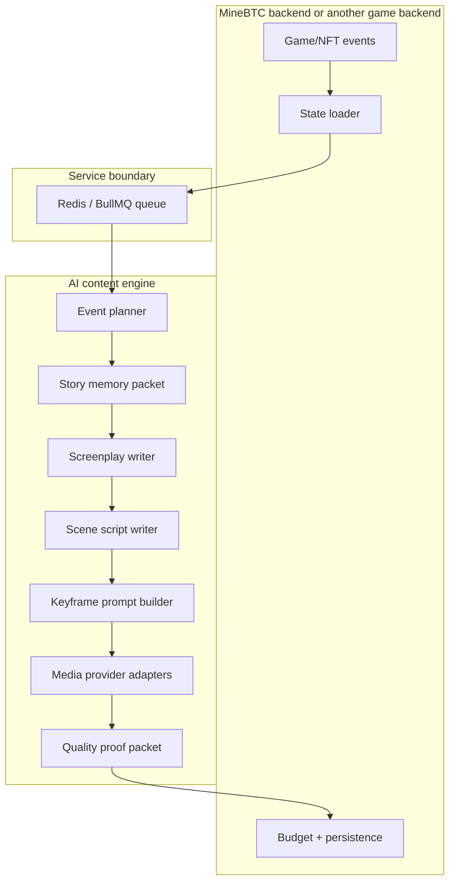

# Architecture

The engine is split into a reusable creative core and runtime adapters.

## Runtime Shape



## Boundaries

Backend responsibilities:

- Load live game/NFT/user/economy state.
- Decide budgets, rate limits, and posting windows.
- Persist draft and canon content.
- Trigger the engine over Redis/BullMQ.
- Own private infrastructure and production secrets.

Content engine responsibilities:

- Convert events into story beats.
- Build character canon and prompt blocks.
- Write screenplays, scene scripts, frame plans, and motion prompts.
- Track reusable world-pack and trailer definitions.
- Produce prompt packets and proof metadata for generated media.

## Design Principle

Keep the creative layer portable. If a function only needs a character, event, story memory, style guide, or prompt input, it belongs in this repo. If a function needs production DB access, wallet state, private queues, admin keys, or posting credentials, it belongs behind an adapter.

## Service Mode

The backend sends jobs to `CONTENT_ENGINE_QUEUE`, which defaults to `minebtc-content-engine`.

```bash
docker run -d -p 6379:6379 --name valkey valkey/valkey:alpine
npm run service:worker
```

The worker supports jobs such as:

- `plan_event`
- `plan_pulse`
- `write_screenplay`
- `write_scene_script`
- `build_scene_keyframe_prompt`
- `build_character_reference_block`
- `build_director_prompt_block`
- `build_negative_visual_prompt`
- `build_video_motion_rules_block`
